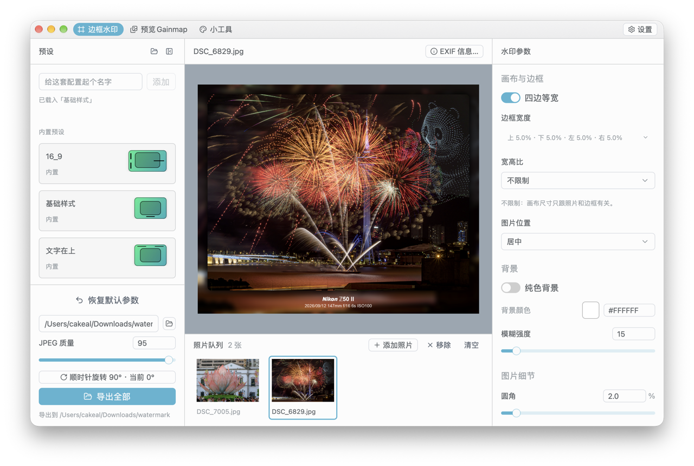
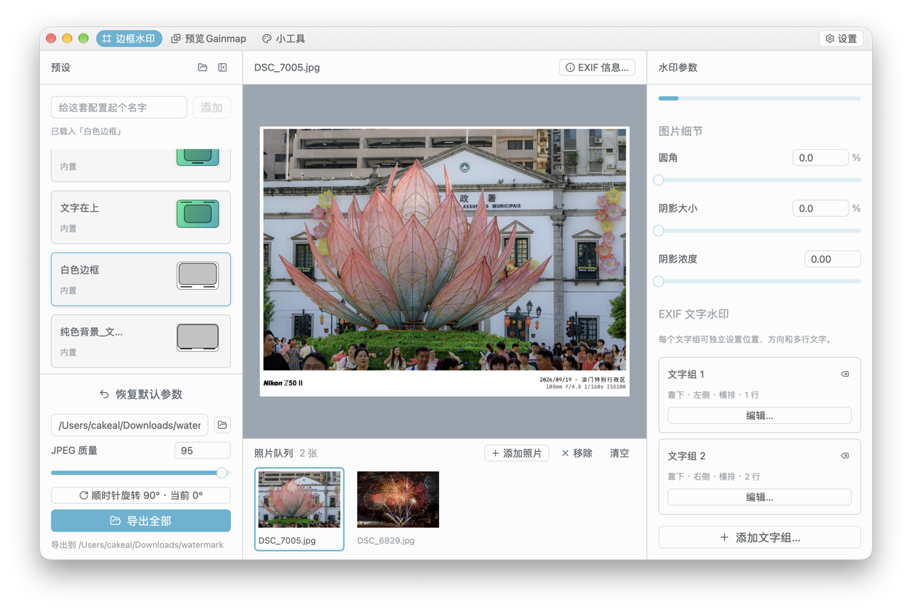
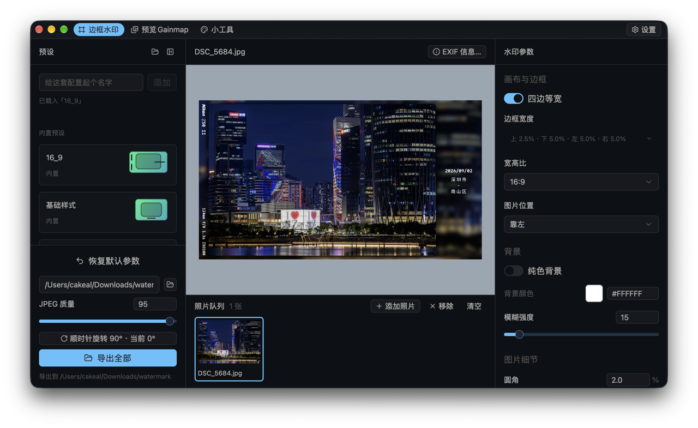
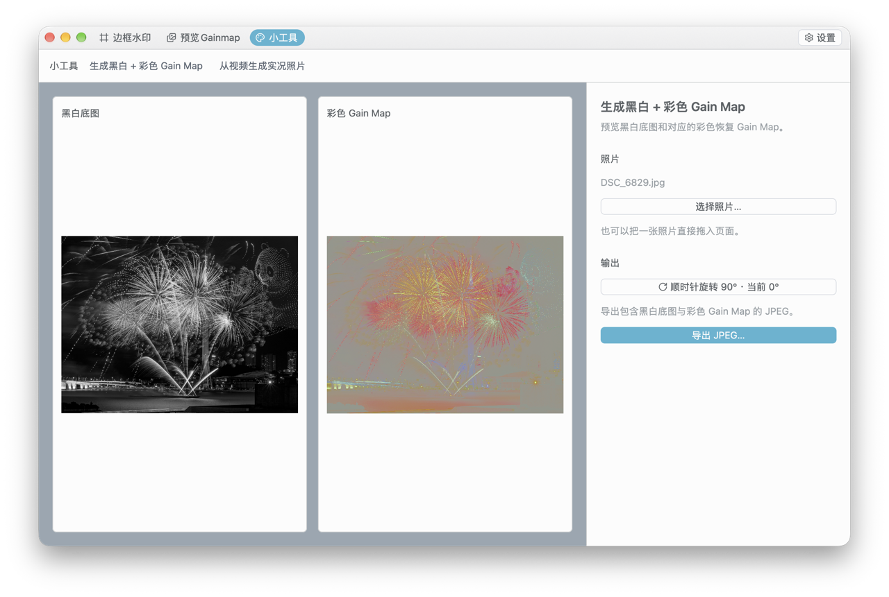
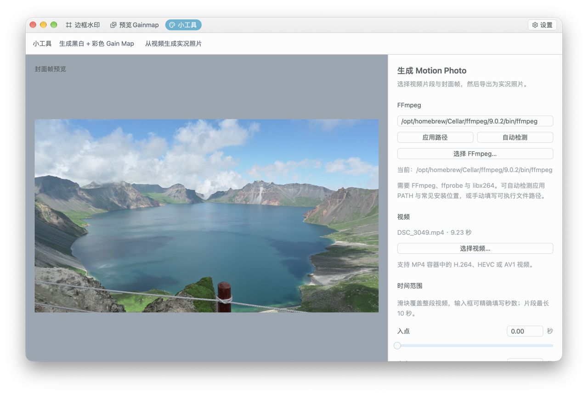

# Lumen Frame

Lumen Frame 是一款添加边框水印的工具。  
它还提供 Ultra HDR Gain Map 查看、黑白底图与彩色 Gain Map 生成，以及从视频制作 Motion Photo 的小工具。

产品介绍与下载：[Lumen Frame 网站](https://cakeal.github.io/lumen-frame/)。网站源码位于 `website/`，推送到 `main` 后由 GitHub Actions 发布到 GitHub Pages。

## 特色

1. 支持调整文字的位置（通过文字组），可以在照片的上面下面左面右面！
2. 可以导出固定比例的照片，比如16:9，而且可以自由决定照片的放置位置（比如靠左）。
3. Exif 可以编辑，应用到导出。
4. 自动根据照片GPS信息识别省市区。
5. 内置部分预设，也可以保存自己的边框水印预设。
6. 如果原图含HDR Gain Map，导出的水印同时保留HDR Gain Map (此时图片大小会限制在 8192x8192，由于`libultrahdr`限制)。
7. 提供小工具，生成Motion Photo（实况照片）以及“黑白 + 彩色Gain Map”的照片。
8. 不含任何恼人的Web技术 (Chromium 以及 Electron)，UI使用 `gpui-kit` 构建，照片处理使用`vips`。

## 界面预览

默认样式：



白色边框样式：



宽高比设置为16:9，左侧竖排文字，右侧显示时间和地区的样式：



生成黑白 + 彩色 Gain Map：



从视频生成 Motion Photo (需要手动指定FFmpeg的文件路径，本体不自带)：



## 下载与使用

[GitHub Releases](https://github.com/CakeAL/lumen-frame/releases) 下载与设备匹配的版本：

| 平台 | 下载文件 | 使用方式 |
| --- | --- | --- |
| macOS Apple Silicon | `Lumen-Frame-<版本>-macOS-arm64.dmg` | 打开 DMG，将应用拖入“应用程序” |
| macOS Intel | `Lumen-Frame-<版本>-macOS-x86_64.dmg` | 打开 DMG，将应用拖入“应用程序” |
| Windows x86-64 | `Lumen-Frame-<版本>-Windows-x86_64.zip` | 解压整个文件夹后运行 `lumen-frame.exe`；不要只复制 exe |
| Linux | 无 | 自行从源代码构建 |

macOS 安装包目前采用临时签名，首次打开如被系统拦截，可在 Finder 中右键应用并选择“打开”。Windows 安装包使用精简版 libvips，支持 AVIF，不接受 HEIC 和相机 RAW；macOS 使用 Homebrew 的完整 libvips，相关格式仍建议用实际照片验证。

边框水印和 Gain Map 功能不需要 FFmpeg。使用 Motion Photo 前，需另行安装包含 `ffprobe` 和 `libx264` 的 FFmpeg。应用会自动检测 PATH 与常见安装位置，也可以在小工具页面手动指定 `ffmpeg` 可执行文件。输入为 MP4；导出时视频统一编码为 H.264，以提高兼容性。Motion Photo 是否能播放还取决于目标相册或平台，建议导出后在目标设备上确认。

（Motion Photo和HDR已在小红书/小米15相册播放测试过。）

## 开发

需要较新的稳定版 Rust 及本机可用的 libvips (参考：https://github.com/houseme/vips-sys/blob/main/README_CN.md)。

```bash
# macOS
brew install vips
cargo run
```

Windows 构建需要 vcpkg 和 libvips 8.16.6 (vips-dev-x64-web-8.18.6.zip)。  

vcpkg 需要手动 overlay 安装 vips-dev-x64-web-8.18.6 （vcpkg 最新的 vips 是 `8.18.5`，没有`.6`，然后，`vips-sys`的库可能识别 vcpkg 的 port 有错误，应是 `libvips`，但是却识别 `vips`）

```bash
# Windows
vcpkg install vips:x64-windows --overlay-ports=.\vcpkg-overlay
# 手动在 .cargo/config.toml 设置 vcpkg 文件夹
cargo run
```

完整的依赖准备、macOS DMG 与 Windows ZIP 打包步骤见 [打包文档](docs/packaging.md)；代码模块说明见 [架构文档](docs/architecture.md)。

## 反馈

发现问题或希望增加功能，欢迎前往 [GitHub Issues](https://github.com/CakeAL/lumen-frame/issues)。
